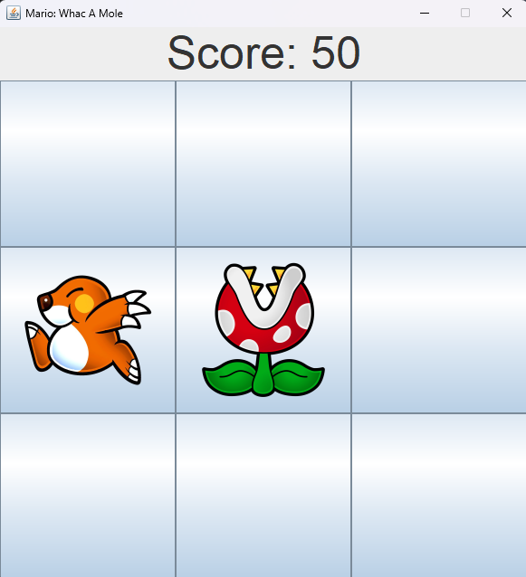

# Whac-A-Mole


<p align="center">
  
</p>

🎮 **Whac-A-Mole** is a Java game inspired by the classic arcade with a *Super Mario* twist.  
The goal is to hit the moles as they pop up at the right time!

## 📦 Project Structure

- `src/` → Java source code  
- `bin/` → compiled files (.class)  
- `.vscode/` → Visual Studio Code configuration

## 🚀 How to Run the Game

1. Make sure you have **Java JDK installed** (Java 8 or higher).  
2. Open the project folder with your preferred IDE (for example VS Code or IntelliJ).  
3. Compile the Java sources:  

```bash
javac -d bin src/*.java
````

4. Run the game:

```bash
java -cp bin Main
```

> If you use an IDE like VS Code or IntelliJ, you can simply **run the main file** directly from the editor.

## 📌 Features

* Classic *Whac-A-Mole* arcade gameplay
* Hit-and-react mechanics to hit the moles
* Simple and intuitive graphical interface

## 🎯 Future Goals

* Add **score and high score**
* Sound effects and animations
* Increase difficulty as the game progresses

## 📝 License

This project is open source and can be freely modified.
